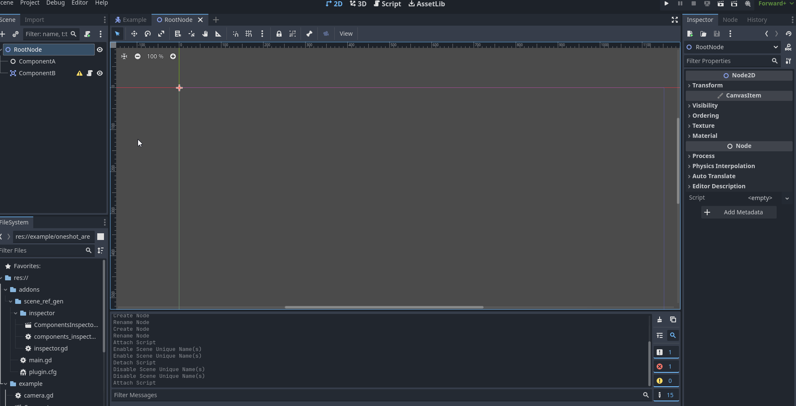

# Scene root reference maker

This small plugin aims to create component references in the scene's root script easier. 

Every node with a unique name is considered as a component. When you open a root node, 
a list of components appear in the inspector. You can then decide if you want to have a reference for it, 
and whether the reference should be private or public.

Generated references are located in a code region that you can safely move to a line you want it to be.

## Purpose

GDScript supports special syntax for referencing unique nodes, so why make additional references? Here's a few reasons:

- `%Node` is a substitute for `get_node('%Node')`, so every time you use `%Node`, you're making an extra method call. 
  With references you can target a node directly.
- If you're using static type checking warnings, they will fire when trying to call methods from `%Node`, 
  as it doesn't know the node's type (since it's actually a method call that returns the most basic `Node` type)
- Public references let you expose the scene's components to a broader context. 
  For example, a Player scene uses a StatModifiers component node, used in many other entities. 
  If you expose this component as a public reference in the root node, you can easily add or remove modifiers 
  in systems that have access to the Player node, such as areas, enemies, and so on.

## Usage

1. Create a script for the scene's root and save the scene
2. Set unique names for nodes you deem as components
3. Select the root node. You will see the list of your components and their reference state
4. Set the reference states

